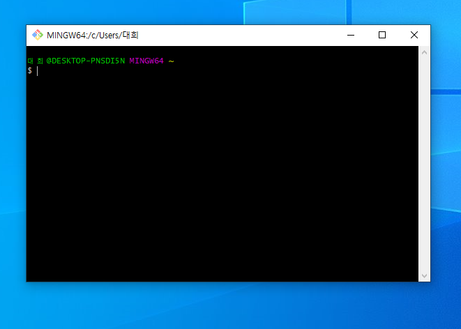

# manuals
깃허브 사용법을 연습합니다.

여기에 원하는 내용을 입력하세요.

작성한 **소스**에 __대한__ 간단한 *소개글*을 ~~작성~~합니다.

>원하는 내용을 입력하세요

>>저장소에 대한 소개글을 작성합니다.

# 제목을 표시

---

***
1. 테스트
2. 연결하기
4. 푸시
3. 풀하기

- 원격저장소 만들기
  - 오리진 연결하기
  - 푸시
- 풀VS페치
- 협업하기

* 별기호 섞어쓰기


```
function add(x,y) {return x+y;}
<script>
  var now = new Date();
</script>
```

<http://www.ysc.ac.kr>

[용인예술과학대학](http://www.ysc.ac.kr)



